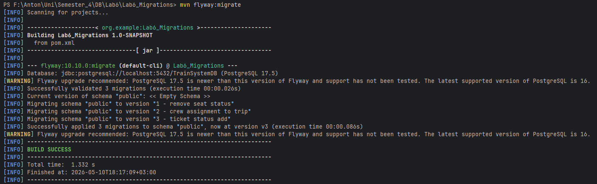
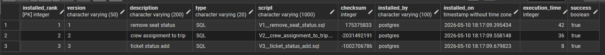
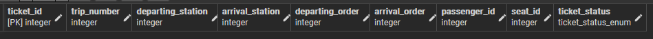

# Зайцев Антон ІО-46 Лабороторна Робота №5 з дисципліни Організація Баз Даних
## Міграції схем за допомгою Flyway

---

## Цілі
- Використати Flyway для керування схемами та дослідити, як Flyway може аналізувати та змінювати схему вашої бази даних.
- Зрозуміти конвенцію іменування Flyway-скриптів, застосування міграцій, генерування та застосування змін схеми.
- Написати кілька версійних SQL-міграцій для вашої схеми та застосувати їх через Flyway. 
- Перевірити результати змін за допомогою SQL-запитів і задокументувати їх. 
- Навчитися коректно використовувати контролювання версій міграцій у Git (скрипти зберігаються у проекті, а не змінюються після застосування).

---

## Виконання лабороторної роботи

[Опис міграцій](migrations-notes.md)
- [V1__remove_seat_status](src/main/resources/db/migration/V1__remove_seat_status.sql)
- [V2__crew_assignment_to_trip](src/main/resources/db/migration/V2__crew_assignment_to_trip.sql)
- [V3__ticket_status_add](src/main/resources/db/migration/V3__ticket_status_add.sql)

## Міграції

---

### Після застосування міграції [V1__remove_seat_status](src/main/resources/db/migration/V1__remove_seat_status.sql)

### Після застосування міграції [V2__crew_assignment_to_trip](src/main/resources/db/migration/V2__crew_assignment_to_trip.sql)

### Після застосування міграції [V3__ticket_status_add](src/main/resources/db/migration/V3__ticket_status_add.sql)
